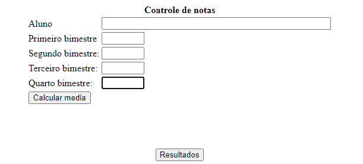

<h1 align="center">💗 Controle de notas 💗</h1>

Página para controle de médias de alunos, construída em PHP

## 💌 Tecnologias

Esse projeto foi desenvolvido com as seguintes tecnologias:

- HTML 
- PHP

## 💌 Preview primeira folha:

 

  

